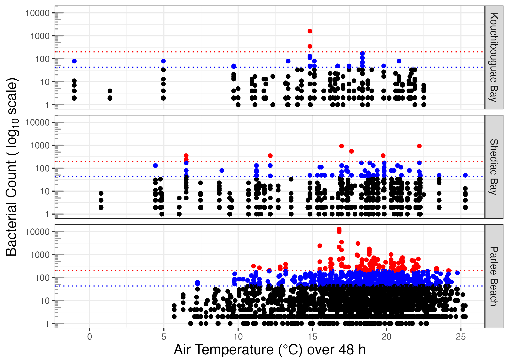
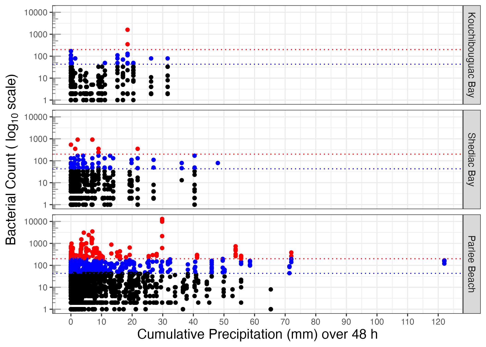
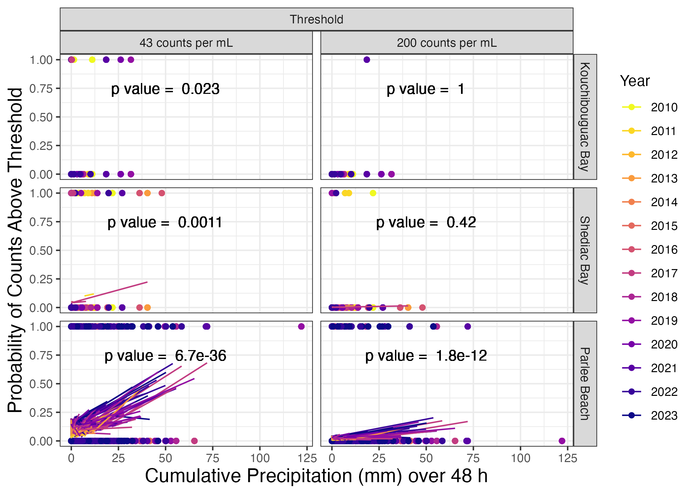
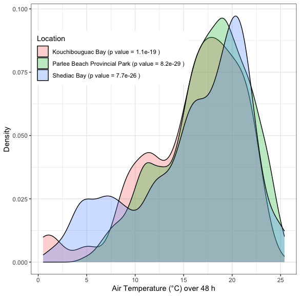

# Introduction {.unnumbered}

Preserving high water quality in the Northumberland Strait is crucial for the well-being of its marine ecosystems and the shellfish harvesting and tourism industries which support the local economy. *Escherichia coli* (*E. coli*) and Faecal Coliform found in water are used as indicators of the possible presence of other pathogenic microorganisms of faecal origin. As such, they are used to monitor, assess and predict microbial water quality in the environment, both for food harvesting [@godinMarineWaterQuality2013] and for recreational activities [@healthcanadaGuidelinesCanadianRecreational2012]. 

Faecal contamination can enter water bodies as a result of heavy rainfall and stream discharge, while *in situ* bacterial growth is positively associated with increased air and water temperatures [@adolfEnterococcusExceedancesRelated2022a; @sanchezRegionSpecificAssociationsEnvironmental2021; @ackermanRelationshipRainfallBeach2003]. Detections of repeated faecal contaminations at New Brunswick's Parlee Beach (46.239706°, -64.509637°) raised community concerns in 2016-2017, leading to an Integrated Watershed Management Plan for the Shediac Bay Watershed, on the Northumberland Strait [@departmentofenvironmentandlocalgovernmentgovernmentofnewbrunswickIntegratedWatershedManagement2021]. 

In response we assembled microbial water quality data records for the Northumberland Strait, largely from many years of Shellfish Surveys completed by Environment and Climate Change Canada [@environmentandclimatechangecanadaShellfishWaterClassification2020], along with data records from provincial and municipal government agencies, Non-Governmental Organizations and citizen science sources. These data on faecal contamination of coastal and estuarine waters are now deposited in the DataStream open access database [@gordonfoundationDataStream2023], sponsored by the Gordon Foundation. We herein outline our data assembly, curation and deposition, along with preliminary analyses of contamination patterns at three representative sites on the Northumberland Strait coast of New Brunswick, to demonstrate how open data can be used to inform policy and management decisions.

## Objective {.unnumbered}

Demonstrate the utility of open access water quality records to support analyses of patterns of microbial contamination, specifically bacterial counts, at three diverse locations along the Northumberland Strait (Figure \@ref(fig:sites)), over years, seasons, and in response to weather.

## Study Sites {.unnumbered}

(\#fig:sites)Study sites - Kouchibouguac Bay, Shediac Bay and Parlee Beach Provincial Park, Northumberland Strait, New Brunswick, Canada.

**Kouchibouguac Bay** (46.848534, -64.929960) is a shallow bay located in a less developed, predominantly forested area within Kouchibouguac National Park. Although a popular summer tourist destination, the Park is closely regulated and restricted to recreational activities. It received 243,489 visitors in 2022-2023 [@parkscanadaOpenGovernmentParks]. Temperature and rainfall data for Kouchibouguac Bay were taken from Environment and Climate Change Canada station "KOUCHIBOUGUAC": Station ID 26968 (lat 46.78, long -65.02) for years 2000-2015 and Station ID 54538 (lat 46.79, long -65.01) for years 2016-2022.

**Shediac Bay** (46.281516, -64.524428) is a shallow bay adjacent to the town of Shediac (population ~8000 @governmentofcanadaStatisiticsCanada) and other smaller villages, with Parlee Beach situated at the southern entrance to the bay. Shediac Bay has a long history of development with a mixture of commercial activity, large residential developments, cottages, marinas, docks, small farms and single residences close to shore. Temperature and rainfall data for Shediac Bay were taken from Environment and Climate Change Canada station "MONCTON/GREATER MONCTON ROMEO LEBLANC INTL A": Station ID 6207 (lat 46.79, long -65.01) for years 2010-2011 and Station ID 50309 (lat 46.79, long -65.01) for years 2012 to 2023.

**Parlee Beach Provincial Park** (46.239706°, -64.509637°), at the mouth of Shediac Bay, is one of the most popular beaches in Eastern Canada with 736,426 visitors in 2021-2022 [@tourismheritageandculturegovernmentofnewbrunswickTourismHeritageCulture2022]. Parlee Beach is immediately adjacent to dense cottage development in Port du Chene, New Brunswick, and hosts a restaurant on the beach itself. Temperature and rainfall data for Parlee Beach were taken from Environment and Climate Change Canada station "MONCTON/GREATER MONCTON ROMEO LEBLANC INTL A": Station ID 6207 (lat 46.79, long -65.01) for years 2010-2011 and Station ID 50309 (lat 46.79, long -65.01) for years 2012 to 2023.

# Materials and Methods {.unnumbered}

Microbial water quality data records exist dating back over 80 years for Southeastern New Brunswick and the Northumberland Strait. Records, totalling 205,772, derive in large part from Shellfish Surveys completed by Environment and Climate Change Canada [@environmentandclimatechangecanadaShellfishWaterClassification2020], along with data generated by various government agencies, Non-Governmental Organization and citizen science sources. Records were obtained via access to information requests submitted by concerned citizens in the Shediac Bay area, our internet and library searches of government reports, and from direct communication with Environment and Climate Change Canada staff. Data from these diverse sources required extensive tidying and curation by Mount Allison University undergraduate students and research staff, for assembly into a standardized format suitable for deposit [@mountallisonuniversitycampbelllabMountAllisonPhyto2023] into the Gordon Foundation’s DataStream (https://atlanticdatastream.ca), an open access common platform for sharing structured information on fresh and marine water health delivered on a national scale, in collaboration with regional monitoring networks.

In response to public demand for transparency in water quality reporting and resulting media coverage, New Brunswick Department of Health now posts bacteria contamination data for various public beaches, including intensive sampling through the summer months for Parlee Beach Provincial Park [@newbrunswickdepartmentofhealthGovernmentNewBrunswick2017]. The Environment and Climate Change Canada Shellfish Water Classification Program data is now publicly accessible through Open Canada [@environmentandclimatechangecanadaShellfishWaterClassification2020], and these records are being uploaded to DataStream, separately from our assembly and curation efforts for data from the Northumberland Strait shores of New Brunswick.

A sub-set of 7173 records from the curated dataset, from years 2010-2023, for Kouchibouguac Bay, Shediac Bay and Parlee Beach, was analyzed in this paper. Bacterial counts were reported as "Faecal Coliform" or as "*Escherichia coli*", with units of Most Probable Number (MPN) or Colony Forming Units (CFU) per 100 mL. Bacterial counts were in most cases used as reported, however, values recorded as above or below a limit of analytical detection were handled as follows. To cope with plotting on log~10~ scale, bacterial counts recorded as zero CFU/100 mL (i.e. Parlee Beach year 2017) are here plotted and analyzed as "1 CFU/100 mL". Bacterial counts recorded as falling below a limit of detection of two CFU/100 mL ("< 2"), are here plotted and analyzed as "1 CFU/100 mL ". Bacterial counts recorded as falling below a limit of detection of ten MPN/100 mL ("< 10"), are here plotted and analyzed as "5 MPN/100 mL". Bacterial counts recorded as falling above a limit of detection of 400 CFU/100 mL ("> 400"), (i.e. Parlee Beach, August 8, 2021) are here plotted and recorded as "400 CFU/100 mL".

Precipitation and air temperature data for the three sites were accessed from Environment and Climate Change Canada [@environmentandclimatechangecanadaHistoricalClimateData2023] using the 'weathercan' [@R-weathercan] package. Assembly of bacterial count data, weather data, analysis and presentation were done using the 'knitr' [@R-knitr], 'tidyverse' [@R-tidyverse], 'datastreamr' [@R-datastreamr], 'lutz' [@R-lutz], 'kableExtra' [@R-kableExtra], 'googlesheets4' [@R-googlesheets4], 'viridis' [@R-viridis], 'stats' [@R-stats] and 'broom' [@R-broom] packages running under R and R Studio (Posit Team, 2023; R Core Team, 2023). Bacterial counts were plotted, analyzed and compared to sampling date, total cumulative precipitation, and mean air temperature over 48 h prior to sample collection date for years 2010 to 2023. 

Health Canada epidemiological guidelines for swimming [@healthcanadaGuidelinesCanadianRecreational2012] are a) A geometric mean of most recent five samples \≤ 200 *E. coli* per 100 mL OR b) a single-sample maximum \≤ 400 *E. coli* per 100 mL. Environment and Climate Change Canada Shellfish Survey approves shellfish harvest areas if a) the median or geometric mean faecal coliform MPN of the water is \≤ 14 per 100 mL AND b) not more than 10% of the samples exceed a faecal coliform MPN of 43 per 100 mL, for a five-tube decimal dilution test [@americanpublichealthassociationStandardMethodsExamination2022]. For plotting and analyses we use reference lines of 200 and 43 bacterial counts per 100 mL. 

# Results and Discussion {.unnumbered}

For years 2010-2023 we firstly plot bacterial count (Faecal Coliform or *Escherichia coli* per 100 mL) vs. sample collection date (year) (Figure \@ref(fig:year)).

(\#fig:year)Bacterial count (Faecal Coliform or *Escherichia coli* per 100 mL) (log~10~ scale) vs. sample collection date, at study sites from years 2010 to 2023, with thresholds of 200 (red dotted line) or 43 (blue dotted line) Bacteria per 100 mL. Parlee Beach had increased sampling intensity from year 2017 onward.

In subsequent statistical analyses sampling date is included as a co-variant, to capture any temporal trends in contamination events.

We next plotted bacterial counts vs. average air temperature (°C) over the preceding 48 h, from the weather stations nearest the respective sampling sites (Figure \@ref(fig:temp)).

(\#fig:temp)Bacterial count (Faecal Coliform or *Escherichia coli* per 100 mL) (log~10~ scale) vs. average air temperature (°C) over preceding 48 h, at study sites from years 2010 to 2023, with thresholds of 200 (red dotted line) or 43 (blue dotted line) Bacteria per 100 mL.

Temperature at the time of sampling at all three study sites showed a left-skewed distribution [@shapiroAnalysisVarianceTest1965] peaking at around 18 °C (Supplemental Figure \@ref(fig:ggdensity)). 

We next plotted bacterial counts vs. cumulative precipitation (mm) over the preceding 48 h (Figure \@ref(fig:precip)) from the weather stations, since coastal contamination often results from run off [@healthcanadaGuidelinesCanadianRecreational2012, @maninAssessmentSpatioTemporalVariability2022]. Note that most measurement points fell on days with low cumulative precipitation over the preceding 48 h, a pattern partially obscured by heavy overlap of many points below ~ 10 mm cumulative precipitation.

(\#fig:precip)Bacterial count (Faecal Coliform or *Escherichia coli* per 100 mL) (log~10~ scale) vs. cumulative precipitation (mm) over preceding 48 h, at study sites from years 2010 to 2023, with thresholds of 200 (red dotted line) or 43 (blue dotted line) Bacteria per 100 mL.

To uncover potential predictors of contamination risk, we used a binomial analyses of the probability of bacterial counts falling above regulatory thresholds, in response to cumulative precipitation over 48 h (Figure \@ref(fig:model1), Table \@ref(tab:StatsAll)).

(\#fig:model1)Binomial probabilities of bacterial count above 43 or 200 Bacteria per 100 mL threshold, vs. cumulative precipitation (mm) over 48 h, with year (2010 to 2023) and mean temperature (°C) over preceding 48 h as covariants. See Table 1 for model slopes and p values.

<table class=" lightable-classic" style='font-family: "Arial Narrow", "Source Sans Pro", sans-serif; margin-left: auto; margin-right: auto;'>
<caption>(\#tab:StatsAll)Summary statistics of binomial probabilities and p values for bacterial count above 43 or 200 Bacteria per 100 mL threshold, vs. cumulative precipitation (mm) over 48 h, with year (2010 to 2023) and mean temperature (°C) over preceding 48 h as covariants.</caption>
 <thead>
  <tr>
   <th style="text-align:left;"> Location </th>
   <th style="text-align:right;"> Bacterial Threshold </th>
   <th style="text-align:right;"> Precip 48 h </th>
   <th style="text-align:right;"> Year </th>
   <th style="text-align:right;"> Temp 48 h </th>
   <th style="text-align:right;"> p, Precip 48 h  </th>
   <th style="text-align:right;"> p, Year  </th>
   <th style="text-align:right;"> p, Temp 48 h </th>
  </tr>
 </thead>
<tbody>
  <tr>
   <td style="text-align:left;"> Kouchibouguac Bay </td>
   <td style="text-align:right;"> 43 </td>
   <td style="text-align:right;"> 0.06 </td>
   <td style="text-align:right;"> 0.05 </td>
   <td style="text-align:right;"> 0.05 </td>
   <td style="text-align:right;"> 0.02 </td>
   <td style="text-align:right;"> 0.23 </td>
   <td style="text-align:right;"> 0.19 </td>
  </tr>
  <tr>
   <td style="text-align:left;"> Shediac Bay </td>
   <td style="text-align:right;"> 43 </td>
   <td style="text-align:right;"> 0.04 </td>
   <td style="text-align:right;"> -0.12 </td>
   <td style="text-align:right;"> 0.00 </td>
   <td style="text-align:right;"> 0.00 </td>
   <td style="text-align:right;"> 0.00 </td>
   <td style="text-align:right;"> 0.95 </td>
  </tr>
  <tr>
   <td style="text-align:left;"> Parlee Beach </td>
   <td style="text-align:right;"> 43 </td>
   <td style="text-align:right;"> 0.04 </td>
   <td style="text-align:right;"> 0.14 </td>
   <td style="text-align:right;"> 0.06 </td>
   <td style="text-align:right;"> 0.00 </td>
   <td style="text-align:right;"> 0.00 </td>
   <td style="text-align:right;"> 0.00 </td>
  </tr>
  <tr>
   <td style="text-align:left;"> Kouchibouguac Bay </td>
   <td style="text-align:right;"> 200 </td>
   <td style="text-align:right;"> 1.90 </td>
   <td style="text-align:right;"> 2.11 </td>
   <td style="text-align:right;"> 3.08 </td>
   <td style="text-align:right;"> 1.00 </td>
   <td style="text-align:right;"> 1.00 </td>
   <td style="text-align:right;"> 1.00 </td>
  </tr>
  <tr>
   <td style="text-align:left;"> Shediac Bay </td>
   <td style="text-align:right;"> 200 </td>
   <td style="text-align:right;"> 0.03 </td>
   <td style="text-align:right;"> -0.17 </td>
   <td style="text-align:right;"> -0.09 </td>
   <td style="text-align:right;"> 0.42 </td>
   <td style="text-align:right;"> 0.11 </td>
   <td style="text-align:right;"> 0.15 </td>
  </tr>
  <tr>
   <td style="text-align:left;"> Parlee Beach </td>
   <td style="text-align:right;"> 200 </td>
   <td style="text-align:right;"> 0.03 </td>
   <td style="text-align:right;"> 0.15 </td>
   <td style="text-align:right;"> 0.07 </td>
   <td style="text-align:right;"> 0.00 </td>
   <td style="text-align:right;"> 0.00 </td>
   <td style="text-align:right;"> 0.00 </td>
  </tr>
</tbody>
</table>

At Kouchibouguac Bay (Figure \@ref(fig:model1)), precipitation over the preceding 48 h had a significant influence on the probability of bacterial counts falling above 43 Bacteria per 100 mL threshold (Table \@ref(tab:StatsAll)). Neither successive sampling years nor temperature over preceding 48 h, showed a significant influence on the probability of counts above the 43 Bacteria per 100 mL threshold. At Kouchibouguac Bay we found only one data point falling above the 200 Bacteria per 100 mL contamination threshold (Figure \@ref(fig:model1)), and so precipitation over the preceding 48 h, nor sampling year, nor temperature show a significant influence on the probability of bacterial counts falling above 200 Bacteria per 100 mL threshold (Table \@ref(tab:StatsAll)).

At Shediac Bay (Figure \@ref(fig:model1)), precipitation over the preceding 48 h had a significant influence on the probability of bacterial counts falling above 43 Bacteria per 100 mL threshold, while each successive year decreased the probability of counts above the 43 threshold (Table \@ref(tab:StatsAll)). Neither precipitation over the preceding 48 h, nor sampling year, nor temperature show a significant influence on the probability of bacterial counts falling above 200 Bacteria per 100 mL threshold (Table \@ref(tab:StatsAll)).

At Parlee Beach (Figure \@ref(fig:model1)), precipitation over the preceding 48 h, successive sampling year and temperature over the preceding 48 h all had a significant influence on the probability of bacterial counts falling above both the 43 and 200 Bacteria per 100 mL thresholds (Table \@ref(tab:StatsAll)). A comparative model run with bacterial count above 200 Bacteria per 100 mL threshold, vs. cumulative precipitation (mm) over 48 h, with heaviest rain days removed (> 40 mm cumulative precipitation over 48 h), showed similar results (Supplemental Table \@ref(tab:model3)). 

# Conclusions {.unnumbered}

At Parlee Beach Provincial Park bacterial counts falling above the advisory threshold of 200 Bacteria per 100 mL trended downwards up until 2020, possibly as a result of management and policy interventions [@departmentofenvironmentandlocalgovernmentgovernmentofnewbrunswickIntegratedWatershedManagement2021; @crandallengineeringltdGreaterShediacSewerage2019; @WaterStrategyNew2017; @donelleStateBayWater2017; @hendersonenvironmentalconsultingltdAnalysisFactorsThat1999; @ShediacBylawRestricts2012]. In more recent years days above the 200 Bacteria per 100 mL threshold are again increasing. 

The lack of significant influence of temperature on bacterial counts falling above thresholds at Kouchibouguac and Shediac Bay, suggests faecal bacteria are not growing in the water at these beaches during warmer months, but that episodes of bacterial counts above threshold rather reflect bacteria washed into the beach water. In contrast, temperature does show a significant influence on bacterial counts falling above thresholds at Parlee Beach, so that lagged 48 h temperature may be a useful element in predicting contamination risk. Future analysis could untangle whether temperature has a direct effect on contamination risk or whether temperature is a covariant of factors such as visitor numbers which could drive increases in bacterial counts. 

Precipitation summed over 48 h shows a significant influence on the probability of bacterial counts falling above the advisory threshold of 200 Bacteria per 100 ml at Parlee Beach, suggesting local overland runoff or sewage lift station overflows as contamination sources, since summed 48 h precipitation does not influence the probability of bacterial counts above the advisory threshold of 200 Bacteria per 100 ml at the less developed Kouchibouguac Bay nor in the wider Shediac Bay. The influence of 48 h precipitation is significant, but by no means absolute, since over many periods of high precipitation bacterial counts remained below the threshold. A similar study in the Toronto region of Ontario found increased total rainfall in the preceding 48 h was also positively associated with increased *E. coli* concentrations [@sanchezRegionSpecificAssociationsEnvironmental2021].

Lagged 24 h rainfall has not been a reliable predictor of water quality at Parlee Beach [@newbrunswickdepartmentofhealthGovernmentNewBrunswick2017]. We suggest that lagged 48 h rainfall may instead be a useful predictor of contamination risk at Parlee Beach, and may give temporal clues as to the sources of contamination, which appear to take more than 24 h to influence bacterial counts in the water at the beach. This is of particular concern considering the expected increase in frequency and intensity of extreme rainfall events due to climate change [@kirchmeier-youngHumanInfluenceHas2020].

Future data analyses of Northumberland's coastal beaches could consider the interacting effects of tide and high wind events on water quality as intertidal sediment can be a reservoir for bacteria [@fergusonEnumerationSpeciationEnterococci2005; @boehmTidalForcingEnterococci2005]. Access to local anemometer data for wind monitoring would support these analysis.

Data collected by diverse New Brunswick watershed groups, municipal, provincial and federal government can be assembled and integrated with other data sources to help make strategic regional-based decisions to protect our water and recreational resources.

# Acknowledgements {.unnumbered}

This project was funded by the New Brunswick Department of Health, New Brunswick Innovation Foundation, New Brunswick Environmental Trust Fund and was supported by DataStream (https://atlanticdatastream.ca).
Many Mount Allison University Environmental Microbiology students, student interns and volunteers contributed to the assembly of these data records, notably including S. Arthur, J. Beaulieu, S. Croft, E. Garlock, L. Genge, J. Harper, D.K. Kwon, A. MacCormack, M. Poole, P. Shaver and Dr. W. Li.

# Supplemental {.unnumbered}

(\#fig:ggdensity)Bacterial counts per 100 mL at all three study sites show a left-skewed distribution vs. air temperature (°C) over 48 h, peaking at around 18 °C. P values for departure from normality were determined using the Shapiro-Wilk test.

<table class=" lightable-classic" style='font-family: "Arial Narrow", "Source Sans Pro", sans-serif; margin-left: auto; margin-right: auto;'>
<caption>(\#tab:model3)Summary statistics of binomial probabilities and p values for bacterial count above 200 Bacteria per 100 mL threshold, vs. cumulative precipitation (mm) over 48 h with heaviest rain days removed (more than 40 mm cumulative precipitation over 48 h), and with year (2010 to 2023) and mean temperature (°C) over preceding 48 h as covariants.</caption>
 <thead>
  <tr>
   <th style="text-align:left;"> Location </th>
   <th style="text-align:right;"> Precip 48 h </th>
   <th style="text-align:right;"> Year </th>
   <th style="text-align:right;"> Temp 48 h </th>
   <th style="text-align:right;"> p, Precip 48 h  </th>
   <th style="text-align:right;"> p, Year  </th>
   <th style="text-align:right;"> p, Temp 48 h </th>
  </tr>
 </thead>
<tbody>
  <tr>
   <td style="text-align:left;"> Kouchibouguac Bay </td>
   <td style="text-align:right;"> 1.90 </td>
   <td style="text-align:right;"> 2.11 </td>
   <td style="text-align:right;"> 3.08 </td>
   <td style="text-align:right;"> 1.0 </td>
   <td style="text-align:right;"> 1.00 </td>
   <td style="text-align:right;"> 1.00 </td>
  </tr>
  <tr>
   <td style="text-align:left;"> Shediac Bay </td>
   <td style="text-align:right;"> 0.05 </td>
   <td style="text-align:right;"> -0.16 </td>
   <td style="text-align:right;"> -0.07 </td>
   <td style="text-align:right;"> 0.2 </td>
   <td style="text-align:right;"> 0.11 </td>
   <td style="text-align:right;"> 0.23 </td>
  </tr>
  <tr>
   <td style="text-align:left;"> Parlee Beach </td>
   <td style="text-align:right;"> 0.04 </td>
   <td style="text-align:right;"> 0.12 </td>
   <td style="text-align:right;"> 0.06 </td>
   <td style="text-align:right;"> 0.0 </td>
   <td style="text-align:right;"> 0.00 </td>
   <td style="text-align:right;"> 0.01 </td>
  </tr>
</tbody>
</table>

# References {.unnumbered}

